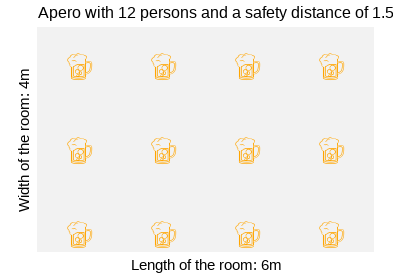
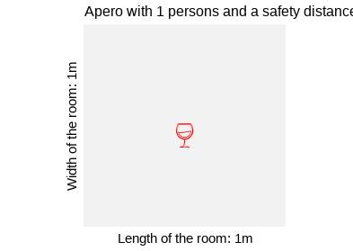

# {apero}

<!-- badges: start -->

[](https://github.com/mayer79/apero/actions)
[](https://app.codecov.io/gh/mayer79/apero?branch=main)

<!-- badges: end -->

## Overview

The {apero} package has three purposes. The last one of course is purely recreational and not at all serious.

1. Its "packaging.R" script explains how to build a simple package using "usethis" and "devtools".
2. It shows how to use S3 object oriented programming.
3. How many guests can you place in a room of given length and width, given that each person should be at least some distance (1.5 m, say) away from each other?

## Installation

```r
library(devtools)
install_github("mayer79/apero", dependencies = TRUE)
```

## Usage

``` r
library(apero)

x <- apero()
summary(x)

> The apero takes place in a 6m x 4m room and the safety distance is 1.5m.
> A whopping 12 guests are here (incl. you). Nice apero so far!
> There will be 66 clinks. Poor glasses...

plot(x)
```



``` r
x <- apero(room_length = 1, room_width = 1)
summary(x)

> The apero takes place in a 1m x 1m room and the safety distance is 1.5m.
> Oh no, you are all alone - the room is simply too small!
>  At least you are not at risk catching a virus...
> There won't be any clink. Lucky glass...

plot(x, emo = "wine_glass", color = "red")
```



